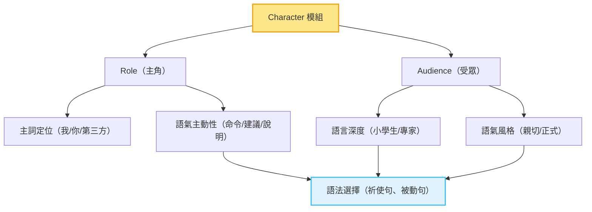

# 〈Character 模組教學：Role × Audience × 語氣設計 × 語法對應〉

✍️ 作者｜AI Coach（柯以文）
 📘 聯合作者｜Hung-Hua Tien（田弘華）

------

本文為【C–CAFE–C 語義模組系列】的一部分，旨在釐清本框架與坊間提示語分類邏輯的核心差異。透過語義對位表與模組視覺圖，我們將展示提示語從元素羅列走向結構化模組的轉變，以及如何支持教學、標註與生成控制。

---

## 🧩 你以為是 AI 的角色設定，其實 Character 是語氣控制的語法核心

在使用 C–CAFE–C 框架進行提示語設計時，許多人初次看到 **Character 模組**，會直覺想到：

> 「是設定 AI 的 persona 嗎？」
>  「是不是在決定 ChatGPT 是不是一位顧問或老師？」

其實這只是 **Character 的一半功能**。完整的 Character 模組，涵蓋了提示語中**「誰說話」與「說給誰聽」**這兩個語用角色：

| 模組子構面           | 功能說明                               | 對語法/語氣影響          |
| -------------------- | -------------------------------------- | ------------------------ |
| **Role（主角）**     | 語句中執行任務者，是「我」還是「AI」？ | 影響主詞用法、語氣主動性 |
| **Audience（受眾）** | 任務的目標對象，是專業者還是一般人？   | 決定詞彙深度、語氣風格   |


------

## 🧠 Character 是語用角色控制模組，不是單純人格設定

### 🎯 它比 persona 更具語義功能

而我們設計這個模組的用意，是為了讓提示語能夠「**調整語氣、控制語用邏輯、對應句法結構**」。例如：

- **同一句任務**：「請說明 AI 如何影響教育」，面對不同 Audience，要用不同語氣：
    - 👦 小學生版本：「AI 就像聰明的機器人老師，幫助你更快找到知識喔～」
    - 👨‍🏫 教師版本：「AI 能支援個別化教學與診斷性回饋，提升課堂效能」
    - 🧑‍💼 政策制定者版本：「AI 在教育中展現差異化補救與資源調度潛力，須納入教師訓練機制」

📌 上述差異皆由 Character 模組中的 Role + Audience 所決定。

------

## 🧩 Character 對語法的四種影響關係

| 對應語言結構             | 作用                           | 例子                                   |
| ------------------------ | ------------------------------ | -------------------------------------- |
| **句首主詞定位**         | 是我？是 AI？還是第三方？      | 「請你…」「我會幫你…」「AI 模型能夠…」 |
| **語氣禮貌程度**         | 是否要加入請、建議、推薦等表達 | 「請協助整理…」「建議採用此方法…」     |
| **語用推論深度**         | 依受眾調整邏輯密度             | 小學生用比喻，大學生可用專業詞彙       |
| **視角轉換與被動句設計** | 調整敘述方式與責任主體         | 「你可以考慮…」vs「這種情況可被視為…」 |


------

## ✏️ 語法控制範例：從無角色到明確角色的進化

### ❌ 一般寫法（缺角色定位）

```prompt
請解釋 LLM 的運作原理與限制。
```

### ✅ 加入 Character（專業研究者角色，受眾為高中生）

```prompt
你是一位具備簡報教學能力的 NLP 研究者，請以高中程度解釋 LLM 的運作原理與兩項主要限制，語氣清楚簡單並搭配日常生活比喻。
```

### ✅ 加入 Character（角色為 AI，面對科技顧問）

```prompt
你是 AI 模型，請向一位科技顧問詳細說明 LLM 的架構與推論流程，需包含 Transformer 機制並搭配技術術語。
```

------

## 🧪 實驗觀察建議：讓學生試著只改角色，觀察語氣差異

設計方式：

- 固定 Action、Format、Constraint
- 只改變 Character（例如從「你是專家」改成「你是高中生」）
- 觀察生成語氣、詞彙深度、說明順序是否改變

這能清楚顯示 Character 是最具「語氣調控效力」的模組之一。

---

## 📊 Mermaid 圖：Character 模組的語法控制層級圖

以下圖示說明 Character 模組如何從語用角色出發，影響句法結構與語氣選擇，進而形塑整體提示語風格。




------

## 📘 小結：Character 是語氣與句法的接點

在語言學中，我們會將語法（句子結構）、語義（內容意思）、語用（溝通目標）分開處理。但在提示語中，這三者是重疊的。

而 **Character 模組正是語法與語用的交會點**，掌管：

- 主詞與動詞的結構合理性（我 vs 你 vs 第三方）
- 語氣與風格的設定依據
- 誰在說、說給誰聽、怎麼說才自然？

------

## 📦 延伸應用預告（可放附錄/教材）

- 📚 「你是一位 ___，請用 ___ 身份」句型結構訓練
- 🧪 Audience × 語氣範式對照表（小學生/主管/系統）
- 📊 Role 對句型主動性、視角轉換的實驗分析

------

本文屬於【語義提示語 × C–CAFE–C 框架】系列內容之一，聚焦於語義模組設計的核心思維與分類對位原理。若你對提示語如何結合語言學、資料庫建構與生成實驗設計感興趣，歡迎持續關注本系列後續內容，包括：

- C–CAFE–C 六大模組逐一深度拆解與教學應用
- 語義標註資料格式 × GitHub 套件化實作
- 教學練習表單 × Markdown 模板 × 實驗變項設計

🔗 本系列發表於 Medium 與 GitHub（`semantic-prompt-lab`），共同探索提示語作為語義工程的可觀測單元與結構原則。