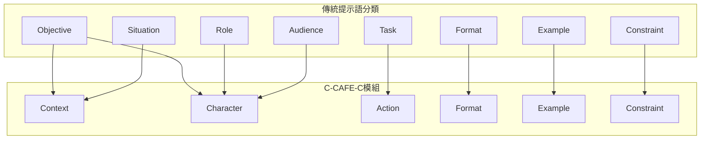

# 從元素堆疊到語義模組：你誤會 C–CAFE–C 的地方，其實大家都會誤會

✍️ 作者｜AI Coach（柯以文）
 📘 聯合作者｜Hung-Hua Tien（田弘華）
 📌 關鍵字：提示工程、語義模組、C–CAFE–C、語用控制、語義對位圖、語言學與工程整合

------

本文為【C–CAFE–C 語義模組系列】的一部分，旨在釐清本框架與坊間提示語分類邏輯的核心差異。透過語義對位表與模組視覺圖，我們將展示提示語從元素羅列走向結構化模組的轉變，以及如何支持教學、標註與生成控制。

---

## 🪧 開場｜為什麼大家一開始都會誤會 C–CAFE–C？

每次在教學中介紹 C–CAFE–C 語義架構時，總會遇到這類提問：

> 「你這框架好像沒有列出 Task 和 Objective？」
>  「Character 是 AI 的 persona 嗎？還是讀者角色？」

這些問題其實都是合理的，因為大多數人對提示語結構的理解，來自於「傳統分類式」框架（如 Task / Goal / Role / Output 等羅列元素），而非像 C–CAFE–C 這樣的「**語義模組化設計**」。

本篇文章的目的，就是要**一次講清楚 C–CAFE–C 和坊間分類框架的核心差異與對應關係**，幫助你理解它的設計原理、教學與資料庫應用價值，並呈現完整語義對位表與圖。

------

## 🧩 傳統提示語元素 vs C–CAFE–C 模組對位表（三欄完整版）

| 傳統提示語元素                     | 對應 C–CAFE–C 模組          | C–CAFE–C 語義定義說明                                        |
| ---------------------------------- | --------------------------- | ------------------------------------------------------------ |
| **Task**（任務）                   | ✅ **Action**                | 指示模型要做什麼行為（如摘要、分類、建議），對應句首動詞。可作為獨立模組操控與實驗觀測。 |
| **Objective**（目標）              | ✅ **Context + Character**   | Context 說明任務背景與用途，Character 調整語氣與邏輯以貼近受眾。共同表達任務的意圖與價值。 |
| **Role**（AI角色）                 | ✅ **Character（Role）**     | 指出主動執行任務的身份，如 AI 專家、老師、顧問等，影響輸出語氣與知識深度。 |
| **Audience**（受眾）               | ✅ **Character（Audience）** | 明確指定輸出對象，如工程師、大學生、孩童等，影響語言風格、詞彙難度與細節程度。 |
| **Situation / Background**（情境） | ✅ **Context**               | 描述任務發生的背景脈絡，包括使用場景、領域限制、前置條件等。具語用意圖與隱含目標導向。 |
| **Output Format**（格式）          | ✅ **Format**                | 明示輸出結構與樣式：如列表、段落、JSON、圖表。是語言輸出組織的結構控制點。 |
| **Example**（範例）                | ✅ **Example**               | 提供示範輸入輸出，支援 zero / few / many-shot。為語義風格引導模組。 |
| **Constraint**（限制）             | ✅ **Constraint**            | 限制字數、風格、用語、語氣等，協助精確控制輸出。為風格與語用上的範圍調控裝置。 |

> ✅ **結論**：**Task 和 Objective 是抽象功能，而 C–CAFE–C 模組強調的是「可觀測、可變動、可組合」，具備統計學上互斥（Mutually Exclusive）且周延（Collectively Exhaustive）特性的語義操作單位。**

------

## 🧠 視覺化語義對位圖（Mermaid 格式）

📌 本圖對應上方表格，幫助視覺化理解「元素羅列 → 模組整合」的邏輯結構。

------

## 🧵 核心設計理念：模組化 × 可觀測 × 可組合

與其將任務目標切成片段式分類，C–CAFE–C 更強調：

- **可觀測性**：每一個語義模組都能獨立調控與觀察生成結果。
- **可組合性**：可依任務需求任意組合使用，無需遵循僵化順序。
- **可標註性**：支援資料庫結構標註、生成控制與語義對位操作。
- **可教學性**：每個模組都能對應教學目標、語法訓練與語用策略。

這使 C–CAFE–C 成為不僅是提示語框架，更是一套**提示語工程語義模型**，能跨語言學、教育、工程與語料庫研究整合應用。

------

## 🪄 延伸應用場景（預告）

- 📘 C–CAFE–C 練習表單（Markdown + Docs 教材版）
- 🧪 Prompt 模組實驗設計教案（A/B 測試與語義變項控制）
- 🧱 語義資料庫標註範式（支援 LLM 自動評估）
- 📊 語義模組生成統計報表模組（推進提示語研究）

------

## 🧭 小結｜從分類走向模組，是語義思維的跨越

傳統提示語設計像是在列舉食譜原料，而 **C–CAFE–C 是一套能做實驗的模組化料理法**。

透過語義對位圖與三欄對照表，我們不只是理解「你少了什麼」，而是知道「你能怎麼組合」、「怎麼控制變項」、「怎麼用語言觀測生成」。

這正是提示語進入下一階段的核心能力。

---

本文屬於【語義提示語 × C–CAFE–C 框架】系列內容之一，聚焦於語義模組設計的核心思維與分類對位原理。若你對提示語如何結合語言學、資料庫建構與生成實驗設計感興趣，歡迎持續關注本系列後續內容，包括：

- C–CAFE–C 六大模組逐一深度拆解與教學應用
- 語義標註資料格式 × GitHub 套件化實作
- 教學練習表單 × Markdown 模板 × 實驗變項設計

🔗 本系列發表於 Medium 與 GitHub（`semantic-prompt-lab`），共同探索提示語作為語義工程的可觀測單元與結構原則。