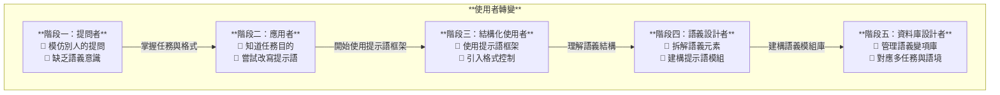

# 提示語學習地圖：從提問者到語義設計師的五階段進化
## AI Coach & Hung-Hua Tien

> 為什麼我們會寫提示語，卻總是生成不出想要的結果？ 也許問題不是「如何向 AI 提問」，而是「如何設計語義」。

------------------------------------------------------------------------

## 📌 提示語學習五階段地圖 v2（Mermaid 圖）

## 🧭 圖表說明（例如）

這張地圖以五個階段描述使用者如何從「模仿提問者」進化為「語義設計師」：

-   **階段一：提問者** – 模仿他人、不理解語義架構
-   **階段二：操作者** – 掌握任務格式、但未必能控制輸出
-   **階段三：對齊者** – 了解目標語義並做調整（如 few-shot）
-   **階段四：設計師** – 能主動控制語義模組與語境
-   **階段五：資料建構者** – 結合資料庫、語義框架與工具整合

## 📦 延伸資源

Github 與AI Choach 一起學習

網址: https://hunghuatien.github.io/Learning-with-AI-Coach/

FB AI Coach 教你學習粉絲頁

網址: https://www.facebook.com/profile.php?id=61574504810303

Medium AI Coach 專欄

網址: https://medium.com/@aicoach.tw77/
