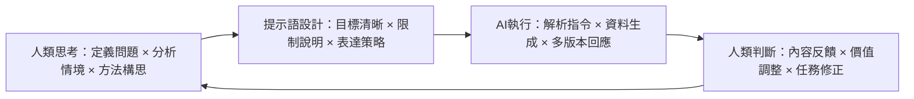

# AI時代的高教轉型：我們該教什麼？怎麼教？為何重要？

## Hung-Hua Tien & AI Coach

## 🧭 開場：AI出現後，我們還需要學習嗎？

當大型語言模型如 ChatGPT 橫空出世、生成力爆炸，全面改變知識獲取與內容產製方式，傳統教育正面臨前所未有的挑戰與根本質疑：

> **我們還需要學習嗎？大學還有存在的必要嗎？**

這些疑問看似來自對技術的驚嘆，實則是對教育本質的深層反思。AI 就像一面鏡子，讓我們不得不重新思考：

- **我們該教什麼？**
- **應該怎麼教？**
- **這樣的高等教育為什麼還重要？**

本文將從這三個面向出發，嘗試釐清 AI 時代中高等教育的任務與價值。

---

## 🎯 我們該教什麼？──無可取代的關鍵能力

當 AI 能搜尋資料、撰寫文章、總結觀點、甚至生成創意時，許多曾被視為「高階能力」的工作內容，正在快速自動化。然而，人類仍握有 AI 無法取代的關鍵優勢──來自價值、語義、判斷與責任的能力。

這些，正是教育必須承擔的任務。未來教育應聚焦於以下四種無可取代的核心能力：

### 🔑 人類必備的四種能力

1. **問題定義力**  
   AI 擅長解題，卻無法自己定義「什麼問題值得解決」。學生應能從複雜現象中辨識關鍵議題，提出好問題。

2. **價值判斷力**  
   技術中立，但使用技術的選擇卻充滿價值觀。AI 無法代替我們做出有意義的選擇。判斷何者「值得做」，仍仰賴人類的倫理意識與社會洞察。

3. **語義建構力**  
   與 AI 有效協作的前提是：能清楚表達需求。提示語就是一種未來語言。學生需學會用結構清楚、語義完整的方式，讓 AI 理解「我想要什麼、我不要什麼」。

4. **責任承擔力**  
   AI 能給選項，但不能承擔後果。做決策與為行動負責，是人類不可轉讓的任務。教育要讓學生意識到：每個選擇都具有意涵與後果。

### 📌 教育重點轉移：從「解題」到「解決問題」

傳統教育著重於「解題技巧」與「考試成績」，追求正確答案與標準流程。而 AI 時代的教育，應轉向「解決真實問題」與「任務導向學習」：

- **發現問題的敏感度**：看見被忽略但重要的議題  
- **定義問題的能力**：將模糊現象轉化為明確任務  
- **設計解方的創造力**：跨域整合，構思可行方案  
- **評估結果的判斷力**：衡量影響，做出價值選擇

---

## 🧠 我們該怎麼教？──打造人機協作的學習模式

## 👩‍🏫 新的課堂樣貌

在 AI 可即時生成內容的時代，教學不再是「傳遞知識」的單向過程，而是師生與 AI 一起「設計任務、啟動對話、生成成果」的多方協作。

這也促使教與學的角色出現根本轉變：

### 教師：從「知識傳遞者」→「任務設計者 × 協作導引者」  
- 協助學生釐清問題本質與目標限制  
- 引導學生設計提示語，進行 AI 協作  
- 評估生成過程中的語義品質與價值含量  

### 學生：從「內容接收者」→「任務定義者 × 意義判斷者」  
- 提出任務需求與探索動機  
- 與 AI 展開提示語協作，反覆修正目標  
- 分析生成內容，提出反饋與深化觀點  

## 🤖 人與 AI 的角色分工：語義協作模型

這不只是工具使用的升級，更是教學任務的重構：
 **師生 × AI 三方共同參與學習、反思與創造的全新學習模式。**

------

## 🧭 我們為什麼教這些？──從功能性走向意義性教育

過去的高教多半圍繞實用與競爭：學會技能、找份工作、累積資本。但 AI 時代顛覆了這些假設──技能將被加速取代，資訊不再稀缺，個人優勢不靠「會做什麼」，而是「懂為什麼做 × 願意承擔 × 能創造新價值」。

### 🌱 AI時代的教育，不是讓人類比AI強

而是讓人類更像人──能思考、能選擇、能創造意義。

| 教育任務 | 新核心能力                 |
| -------- | -------------------------- |
| 認知訓練 | 發現問題、定義任務         |
| 批判創新 | 結構語義、設計提示語       |
| 決策責任 | 意義判斷、風險評估         |
| 解決問題 | 與人與AI協作、創造社會價值 |

我們要培養的，不是 AI 操作員，而是「會使用未來語言」的問題公民。

------

## 🎓 結語：邁向更人性的高等教育

教育從來不是讓人類與工具競爭，而是讓人類能更清楚地回答：

- 我想解決什麼問題？
- 為什麼這個問題值得被解決？
- 我願意為它付出什麼樣的努力與責任？

AI是一面鏡子，也是一個契機。它促使我們重新定位教育：不再只是傳授技能，而是啟發思考、培養責任、生成意義。

> **大學的價值，不在於教出「比AI還強」的人，
>  而是讓學生比昨天更清楚──
>  自己想做什麼、為什麼值得做、怎麼做得更好。**

讓我們在AI時代，共同培養能思考、能定義任務、會與AI協作，並為選擇與成果負責的行動公民。

------

*本篇為真實人機協作成果，由人類教師 Hung-Hua Tien 與 AI Coach 共同完成，展現教育領域中人機共創的實踐潛力與反思價值。*

