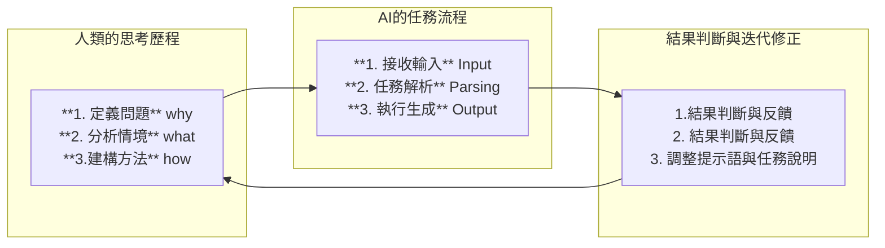

# AI時代的高教轉型三問：我們該教什麼？怎麼教？為何重要？

## AI Coach & Hung-Hua Tien

#高等教育, 教育轉型, AI素養, 教學設計, 存在意義, 問題公民

## 🧭 前言：AI不是威脅，而是鏡子

當大型語言模型逐漸能勝任摘要、寫作、推理、設計與演算等任務時，許多人開始懷疑：我們還需要學習嗎？高等教育還有存在的必要嗎？

但事實上，AI 的到來，反而讓我們更有機會回到教育的本質，重新問出三個重要的問題：

> **我們該教什麼？怎麼教？為何重要？**

這三問，正是高教在 AI 時代進行轉型的核心起點。

------

## 🎯 一、我們該教什麼？——從「知識輸入」到「語義掌控 × 問題定義」

AI 能代替我們計算、分類、摘要、重寫，但它無法替我們回答：

- 「這個問題值不值得解決？」
- 「誰定義了目標？價值觀從何而來？」

因此，AI 時代的教育核心不是傳遞知識，而是培養：

- **價值判斷力**：能辨識資訊的倫理、目的與利害關係
- **問題設計力**：能從混亂現象中釐清問題並拆解結構
- **語義架構意識**：能掌握任務描述、邏輯引導、目標設定等語言骨架

我們不再僅教會學生「怎麼解題」，而是訓練他們「如何定義問題」，並能說出「為什麼這個問題值得解決」。

AI 可以幫你執行任務，但無法告訴你該做什麼、為何而做──這些能力，必須由人類訓練與承擔。

------

## 🧰 二、我們怎麼教？——從「授課測驗」到「語言釐清 × AI協作」

AI 時代的教學現場，不能再只倚賴講授與測驗。
 而應該引導學生**從思考出發、透過語言明確輸出任務**，並與 AI 協作完成目標。

這樣的教學模式，強調人類如何提出清晰的問題、建構語義清楚的表達，並透過 AI 協作進行任務執行與反饋修正。

老師的角色從知識傳授者，轉變為**語義協作的引導者**；學生的角色也從被動聽課者，變為**任務定義者與反饋修正者**。

這是語言、邏輯與責任意識的訓練現場，而不是單純的工具操作。

------

## 🧠 三、為什麼這些重要？——學習從不是技術訓練，而是價值實踐

傳統教育偏重解題與背誦，彷彿學會了知識就能解決問題。
 但在 AI 時代，**解題不再是人的專利，而問題定義與價值選擇仍是人類專屬能力。**

教育的重點應從「知識的傳授」轉向「價值的判斷」與「問題的釐清」。

> **教育的任務不再只是傳遞知識，而是訓練人類如何釐清一個複雜的問題，判斷該用什麼知識，為何要用它，判斷是否使用得當。**

某種程度上，若從真實世界的問題開始探究，那麼理論和實務的區分意義不大，教學、研究和服務的分別也不見了。未來的教育，就是從問題出發的研究歷程，只是不一定是學術研究，而是所有針對某個問題提出分析與解法的探索實踐。

這些問題是否值得探究？如何設定問題？所獲結果的意義在哪裡？或許這些，正是人類存在感的源頭。

在這樣的學習歷程中，老師、學生與AI都可能是帶頭的角色──**關鍵在於：誰願意主動參與、持續學習、讓時間累積出思維的複利。**

------

## 🔄 教育的迴圈：AI × 人類 × 問題 × 語言

------

## ✨ 結語：AI時代的人，是意義與責任的實踐者

高等教育的任務不是「教出比 AI 還強的學生」，而是**教會人類成為最懂人、最會合作、最有判斷力與想像力的存在。**

AI 時代的人不再以「會做什麼」定義自己，而是以「選擇什麼問題、如何賦予意義、是否願意承擔責任」來界定自身價值。

未來的大學生，應該成為：

- **問題的發現者與定義者**
- **意義的建構者與傳遞者**
- **行動的發起者與承擔者**

最後補上一句：

> **提示語是未來語言的橋樑。無論你學什麼、做什麼、與AI合作什麼，你都得透過語言明確指令與語義轉譯，而這正是提示語的任務所在。**

這，就是高等教育在 AI 時代最值得堅持的方向。