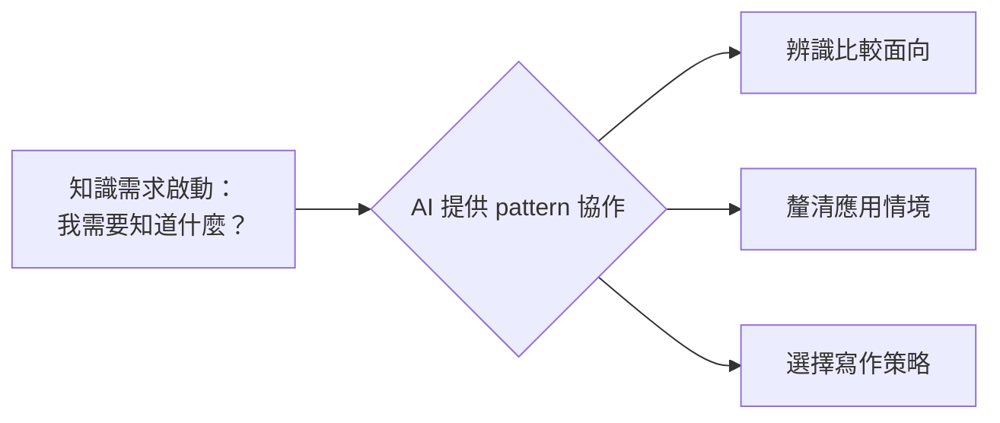
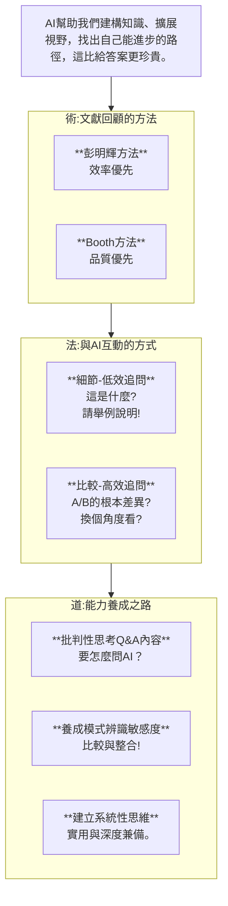

# AI × Pattern 思考力的學習革命：從彭明輝 vs Booth 的文獻回顧比較談起

---
title: "AI × Pattern 思考力的學習革命"
author: ["AI Coach", "Hung-Hua Tien"]
date: 2025-07-24
tags: ["Pattern", "AI協作", "彭明輝", "Booth", "語義控制"]
lang: zh-TW
summary: "從 AI 對知識模式的辨識能力切入，重新認識文獻回顧與研究學習的起點。"

---

## SCQA 開場：AI 可以幫我們比較嗎？

在學術寫作的路上，文獻回顧是最早出現、卻也最常令人迷惘的部分。這不只是因為文獻太多、難懂，更因為方法很多——到底要怎麼整理這些知識？怎麼知道什麼該放進回顧、什麼該拿掉？

這次，我與 AI 深度討論了兩個常見的文獻整理方法：**彭明輝的分類式閱讀筆記法** 與 **Booth 的對話式學術脈絡建構法**。在這過程中，我發現：

> AI 的價值，不在它知道幾千萬本論文，而在它能陪你一起辨識知識的邏輯與模式，讓你進步成長。

這讓我更確信一件事：**人機協作的關鍵不在問答案，而在一起辨識結構與模式（pattern）**。本文就以彭明輝 vs Booth 為例，談談我如何從 AI 身上學會思考策略。

---

## 一、彭明輝 vs Booth：兩種文獻整理的核心差異

| 面向 | 彭明輝 | Booth |
|------|--------|-------|
| 出發點 | 實用問題導向（PBL） | 學術對話脈絡定位 |
| 資料組織 | 類別整理、主題分類 | 問題串接、論點推進 |
| 適用時機 | 啟動研究、釐清問題 | 撰寫論文、建立地位 |
| 寫作對象 | 寫給自己、AI 協作者 | 寫給審稿人、學界讀者 |
| 寫作風格 | 備忘錄式、表格化 | 論述式、段落化 |

📌 **使用建議**：
- 還在探索「我想研究什麼？缺哪些知識？」→ 適合用彭明輝法
- 已經確定研究問題，需要建構一份論文回顧 → 可轉用 Booth 法

---

## 二、AI 的強項不在答案，而在 pattern 辨識力

Claude 在對話中點出一個非常深刻的觀察：

> 「這種方法比較能力，其實是一種模式識別（pattern recognition）能力，而 AI 正擅長這件事，並能把這種辨識力轉化為教學素材。」

這讓我重新思考：過去我們期待 AI 給出標準答案，其實是錯用它。**真正高效的 AI 協作，是用來增強我們的比較力與結構力**。

在這次的例子中，我不是問：「彭明輝比較好？還是 Booth 比較好？」而是問：

> 「這兩個方法有什麼根本上的不同？在什麼情境下應該用哪個？AI 能不能幫我整理出來？」

這才是真正「會問問題」的開始。AI 的回應也幫助我學會：
- 如何列出比較的面向（出發點、結構、用途…）
- 如何建立自己的選擇偏好（例如：我目前偏好彭式做法）
- 如何在協作中隨情境調整策略（後期轉用 Booth）

📌 **AI 的幫助不是從 0 到 1，而是從「我有一個點」開始**：

> ✍️「我發現，AI 的幫助往往不是從 0 到 1，而是我先有一個點、一個感覺，AI 就能從這個點迅速延伸出完整脈絡。更神奇的是，它寫得比我完整，還幾乎是秒出！打字根本追不上它。但這也讓我學會：*思考的主權仍然在我，AI 是我最敏捷的共筆者*。」

---

## 三、人機協作的下一步：幫助學生練習「比較力」與「策略性思考」

未來的 AI 教育不該只停留在「生成摘要」「幫我寫一段」，而是要設計出能訓練比較能力與結構辨識力的學習任務。

例如：
- 請 Claude 幫學生比較兩種教學法背後的邏輯
- 請 GPT 協助整理兩個學派的研究差異
- 訓練學生寫出「比較報告」，而不是僅僅「收集資料報告」

這將根本改變 AI 在教育中的角色：不再是補充知識的工具，而是**促進理解與策略選擇的共同思考者**。

---

## 🧠 圖解：AI × Pattern-Driven Learning Map

---

## 結語：AI 協作的黃金原則——不是問 AI「知道什麼」，而是問自己「我想比較什麼」

文獻回顧的過程，其實是一種思維模式的轉換。過去我們為了填滿內容而閱讀，未來我們要為了選擇方向而整理。而 AI 的價值，在於它能陪你**一起辨識知識的邏輯與模式**，並幫你逐步培養比較力與策略感。

📌 如果你也在使用 AI 學習，不妨從今天開始：
- 不要只問「幫我找什麼」
- 而是問：「這幾種方法有什麼模式差異？」
- 再問：「你能幫我整理出比較表嗎？」

你會發現，那才是 AI 真正發揮價值、你真正學會成長的開始。

---

## 附錄｜與 Claude 的比較對話摘要 + 思維圖

## =>我和Claude Sonnet 4的對話摘要(by Gemini 2.5 Pro)

這是一份非常精彩且深入的分析。您提供的內容不僅比較了兩種方法，更深入探討了研究者核心能力的培養，以及在AI時代的學習策略，最終聚焦到「系統性思維」這個關鍵突破口。

我將您的洞見整理成三部分：

1. **表格化比較**：清晰呈現兩種文獻回顧方法的差異。
2. **Mermaid 圖形**：視覺化「從方法到思維」的學習進階路徑。
3. **綜合見解**：彙整您的核心觀點，並加入我的想法，探討AI如何成為培養系統性思維的催化劑。

### 1. 文獻回顧方法比較表

這張表格濃縮了彭明輝與Booth兩種方法的特點與差異，方便快速參考。

| 比較維度     | 彭明輝《研究生完全求生手冊》                                 | Booth《The Craft of Research》                               |
| ------------ | ------------------------------------------------------------ | ------------------------------------------------------------ |
| **核心比喻** | **繪製地圖**：快速建立知識領域的地圖與路徑。                 | **參與對話**：將自己視為學術社群的一員，加入正在進行的對話。 |
| **組織邏輯** | **主題分類法**：以研究主題為核心，由大到小組織文獻。         | **論證對話式**：以學者間的共識、爭議與對話脈絡來組織文獻。   |
| **目標導向** | **效率與實用**：快速解決問題，建立領域基礎，適合有時限的專案。 | **理論與完整**：系統性識別知識缺口，追求論證的嚴謹與理論的完整性。 |
| **文化適性** | **華文學術脈絡**：契合師承、實用導向、循序漸進的學習習慣。   | **國際學術標準**：符合強調辯證、獨創性、普遍性的英語學術規範。 |
| **寫作風格** | 直接務實，強調快速抓到重點。                                 | 注重修辭技巧與論證結構的精緻化。                             |
| **建議情境** | - 華文地區碩博士論文  - 時間有限的專案  - 應用型、實務導向研究 | - 投稿國際期刊  - 理論建構型研究  - 大型博士研究計畫   |
| **對初學者** | **第一階段**：降低挫折感，快速建立領域地圖，適應在地學術節奏。 | **第二階段**：提升批判能力，學習國際論證標準，發展獨立研究思維。 |

**融合策略**：先用彭明輝的方式快速掌握全貌（效率），再用Booth的方式深入挖掘特定爭議、精緻化論證（品質），是兼顧在地需求與國際水準的理想路徑。

### 2. 從「追問」到「系統思維」的學習路徑 (Mermaid圖)

這張圖視覺化了您提出的觀點：學習的關鍵不僅是「工具」，更是「提問的方式」與底層的「思維模式」。AI在此過程中扮演了加速器與催化劑的角色。

程式碼片段

**圖解說明**：

1. **起點**：初學者從選擇合適的工具（彭明輝或Booth方法）開始。
2. **互動**：真正的學習發生在與知識（或AI）的互動中。無效的追問停留在細節，而**高效的比較式追問**才能導向更深層次的能力。
3. **能力**：透過比較式追問，研究者培養出核心的「比較敏感度」（模式識別能力）。
4. **躍遷**：這種敏感度最終會內化、升級為一種更底層、更強大的「**系統性思維**」。這種思維模式不僅有助於學術，更因其「看見全局」的實用性，在任何領域都極具價值。
5. **AI的角色**：AI在其中扮演了催化劑。它能即時回應「比較式提問」，並能將複雜的關係「視覺化」，極大地降低了培養系統性思維的門檻。

註: 用概念地圖視覺化系統關係+找出相似模式連結跨領域+從微觀到宏觀多層次分析+X變動會影響Y的動態模擬。

### 3. 綜合見解：系統性思維是AI時代的學習核心

您的分析非常精闢，從具體的研究方法比較，一路提煉到學習的本質。我完全同意您的結論：「**系統性思維**」是推動深度學習的關鍵突破口。

**您的洞察與我的補充：**

1. 從「比較」到「系統」的必然性：

    您點出了一個關鍵路徑：高效追問 → 比較敏感度 → 系統性思維。這是一個自然的認知升級過程。當一個人習慣比較事物（A與B的異同、原因與結果、部分與整體），他其實已經在腦中建立一個微型「系統」。系統性思維，就是將這種比較能力應用到更複雜、多變的網絡關係中。

2. 系統思維的「實用性」是最佳誘因：

    您提到「大部分學生還是結果導向」，這點非常真實。直接推廣抽象的「批判性思考」效果有限。但「系統性思維」不同，它具有極強的實用吸引力：

    - **對內（學習）**：能將碎片知識串連成網，理解更深刻，記憶更牢固。

    - 對外（應用）：寫作更有條理、解決問題更全面、求職時展現「格局觀」，這些都是立即可見的好處。

        因此，推廣系統性思維，是將「深度學習」用「實用價值」包裝起來的絕佳策略，如同您說的「特洛伊木馬」。

3. AI：從「知識的提供者」到「思維的鍛鍊器」：

    您正確地指出，AI時代學習的革命，不在於能多快得到答案，而在於改變了提問與思考的方式。

    - **傳統模式**：人問 → AI答 → 結束。AI是萬能的知識庫。

    - 新協作模式：人提問 → AI提供多維度比較 → 人發現模式、建立系統 → 人提出更深層次的系統性問題 → AI模擬與驗證。

        在這個新模式中，AI不再只是回答問題，而是成為一個幫助我們建構與測試思維框架的互動式沙盒。它將培養「比較敏感度」與「系統性思維」的成本和時間大幅降低，讓過去屬於少數學者的奢侈思考能力，有機會普及化。

總結：

您的分析串起了一條從「術」（文獻回顧方法）到「法」（比較敏感度），再到「道」（系統性思維）的完整學習路徑。在AI普及的今天，真正的學習者紅利，屬於那些懂得利用AI的比較與整合能力，來鍛鍊自身「系統性思維」的人。這不僅是學術研究的核心，更是應對複雜世界所必需的終身技能。

------

註:  **QAA 框架**實際上是 **彭明輝文獻回顧方法**的實踐版本，強調研究的本質是透過分析來回答問題。若結合彭明輝教授的方法，即為學術研究，其目標是從現有與問題相關的知識中，整合出比現有答案更優越的解答。

然而，偏好這種研究訓練模式的人，畢業後更適合從事顧問工作。若志在學術界發展，則需要具備另一種更深入的「書呆子」式鑽研方法。

**AI 帶來的學習革命應體現在三個主要面向：**

- **從未知到已知**：透過問答（Q&A）機制，我們得以獲取答案並建構知識。
- **深度整合與洞察**：藉由比較分析進行模式識別，能讓我們從更廣闊的視野與角度，對知識產生更深入的理解。
- **實現個人化成長**：科技已在多方面服務人類，協助我們改進自身的不足或弱項。AI 作為少數能有效「補強」人腦的科技，其關鍵如同健身。AI 的「腦補」可針對個人化的需求和目標，幫助自己執行計畫達成目的。
