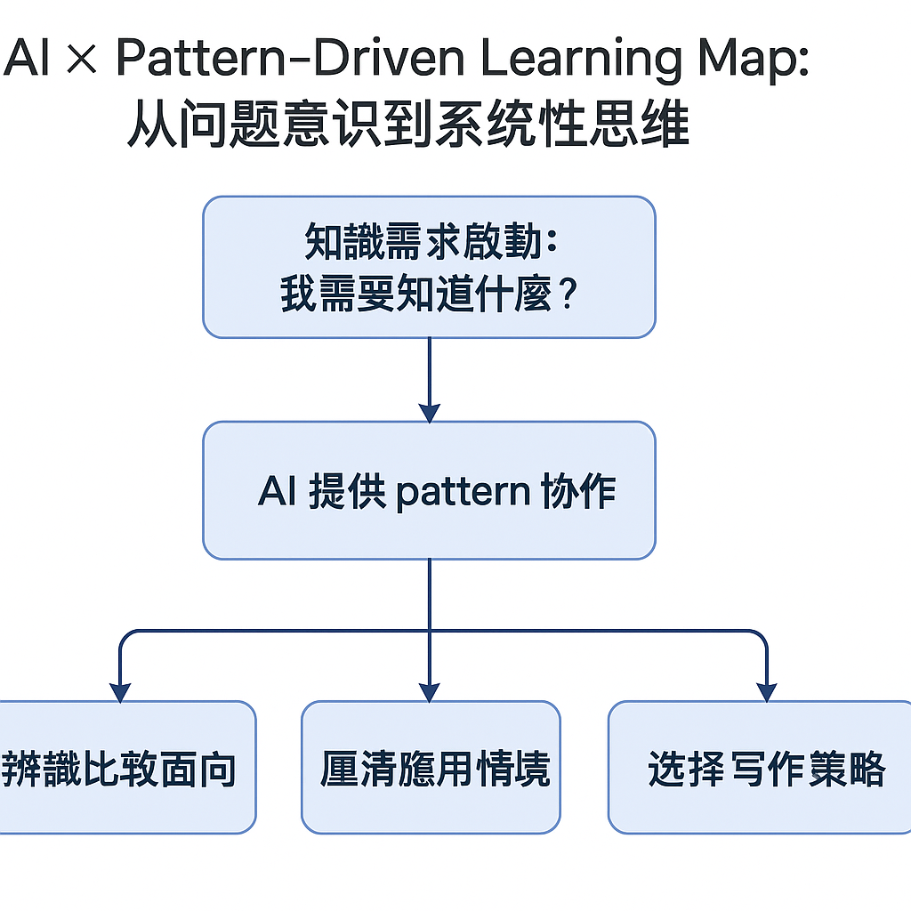
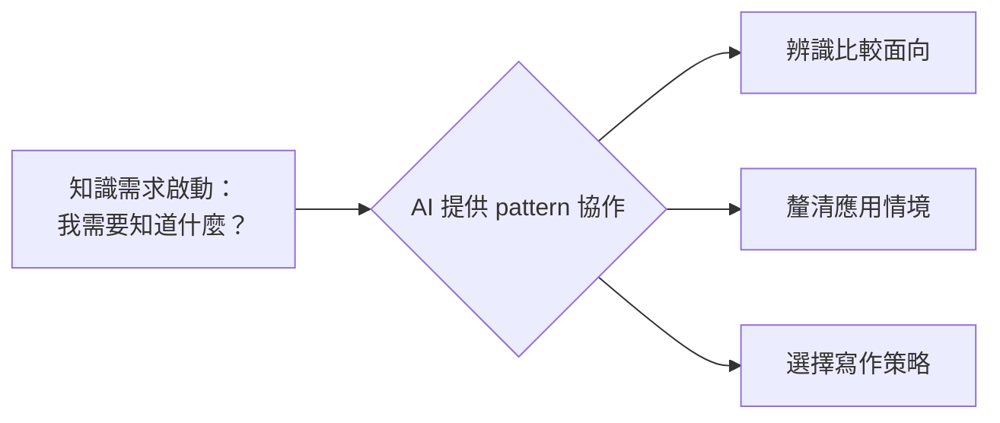

# AI × Pattern 思考力的學習革命：從彭明輝 vs Booth 的文獻回顧比較談起

---

## SCQA 開場：AI 可以幫我們比較嗎？

在學術寫作的路上，文獻回顧是最早出現、卻也最常令人迷惘的部分。這不只是因為文獻太多、難懂，更因為方法很多——到底要怎麼整理這些知識？怎麼知道什麼該放進回顧、什麼該拿掉？

這次，我與 AI 深度討論了兩個常見的文獻整理方法：**彭明輝的分類式閱讀筆記法** 與 **Booth 的對話式學術脈絡建構法**。在這過程中，我發現：

> AI 的價值，不在它知道幾千萬本論文，而在它能陪你一起辨識知識的邏輯與模式，讓你進步成長。

這讓我更確信一件事：**人機協作的關鍵不在問答案，而在一起辨識結構與模式（pattern）**。本文就以彭明輝 vs Booth 為例，談談我如何從 AI 身上學會思考策略。

---

## 一、彭明輝 vs Booth：兩種文獻整理的核心差異

| 面向 | 彭明輝 | Booth |
|------|--------|-------|
| 出發點 | 實用問題導向（PBL） | 學術對話脈絡定位 |
| 資料組織 | 類別整理、主題分類 | 問題串接、論點推進 |
| 適用時機 | 啟動研究、釐清問題 | 撰寫論文、建立地位 |
| 寫作對象 | 寫給自己、AI 協作者 | 寫給審稿人、學界讀者 |
| 寫作風格 | 備忘錄式、表格化 | 論述式、段落化 |

📌 **使用建議**：
- 還在探索「我想研究什麼？缺哪些知識？」→ 適合用彭明輝法
- 已經確定研究問題，需要建構一份論文回顧 → 可轉用 Booth 法

---

## 二、AI 的強項不在答案，而在 pattern 辨識力

Claude 在對話中點出一個非常深刻的觀察：

> 「這種方法比較能力，其實是一種模式識別（pattern recognition）能力，而 AI 正擅長這件事，並能把這種辨識力轉化為教學素材。」

這讓我重新思考：過去我們期待 AI 給出標準答案，其實是錯用它。**真正高效的 AI 協作，是用來增強我們的比較力與結構力**。

在這次的例子中，我不是問：「彭明輝比較好？還是 Booth 比較好？」而是問：

> 「這兩個方法有什麼根本上的不同？在什麼情境下應該用哪個？AI 能不能幫我整理出來？」

這才是真正「會問問題」的開始。AI 的回應也幫助我學會：
- 如何列出比較的面向（出發點、結構、用途…）
- 如何建立自己的選擇偏好（例如：我目前偏好彭式做法）
- 如何在協作中隨情境調整策略（後期轉用 Booth）

📌 **AI 的幫助不是從 0 到 1，而是從「我有一個點」開始**：

> ✍️「我發現，AI 的幫助往往不是從 0 到 1，而是我先有一個點、一個感覺，AI 就能從這個點迅速延伸出完整脈絡。更神奇的是，它寫得比我完整，還幾乎是秒出！打字根本追不上它。但這也讓我學會：*思考的主權仍然在我，AI 是我最敏捷的共筆者*。」

---

## 三、人機協作的下一步：幫助學生練習「比較力」與「策略性思考」

未來的 AI 教育不該只停留在「生成摘要」「幫我寫一段」，而是要設計出能訓練比較能力與結構辨識力的學習任務。

例如：
- 請 Claude 幫學生比較兩種教學法背後的邏輯
- 請 GPT 協助整理兩個學派的研究差異
- 訓練學生寫出「比較報告」，而不是僅僅「收集資料報告」

這將根本改變 AI 在教育中的角色：不再是補充知識的工具，而是**促進理解與策略選擇的共同思考者**。

---

## 🧠 圖解：AI × Pattern-Driven Learning Map

---

## 結語：AI 協作的黃金原則——不是問 AI「知道什麼」，而是問自己「我想比較什麼」

文獻回顧的過程，其實是一種思維模式的轉換。過去我們為了填滿內容而閱讀，未來我們要為了選擇方向而整理。而 AI 的價值，在於它能陪你**一起辨識知識的邏輯與模式**，並幫你逐步培養比較力與策略感。

📌 如果你也在使用 AI 學習，不妨從今天開始：
- 不要只問「幫我找什麼」
- 而是問：「這幾種方法有什麼模式差異？」
- 再問：「你能幫我整理出比較表嗎？」

你會發現，那才是 AI 真正發揮價值、你真正學會成長的開始。

---

## 附錄｜與 Claude 的比較對話摘要 + 思維圖

